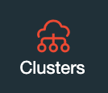
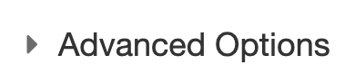
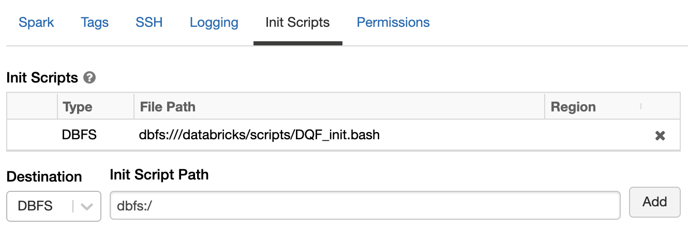
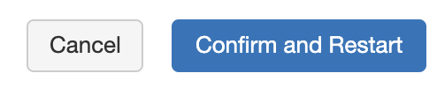

# Install on Databricks Cluster

Data Quality Framework can be installed on a Databricks cluster using an init-script and a Databricks notebook for an inital setup.

This task has to be done once, but can be adjusted later on as well. 

## Prerequisites

- Databricks Workspace with Admin Rights
- Azure DevOps Account
- Azure DevOps Access Token for accessing Azure Artifacts
- Azure KeyVault to store the Azure DevOps Token

## Install Instructions
### Prepare Tokens for Installation
1. Login to Azure DevOps
   - Best Practice is to use a Pool-ID User ([Create a Pool User](https://git.daimler.com/GitHub/Support/tree/master/best-practices))
2. Create Personal Access Token ([Guide](https://docs.microsoft.com/en-us/azure/devops/organizations/accounts/use-personal-access-tokens-to-authenticate?view=azure-devops&tabs=preview-page))
3. Store the created Token. Best way to do that is to put it inside your Azure Key Vault.
4. Create a Secret Scope in Databricks Workspace to your Azure KeyVault([Guide](create_DB_scope.md))

> If using a Pool-ID User, please ensure that sufficient rights are given in Databricks to the User-ID

### Create Data Quality Framework Init-Script and Install Folders (One Time Setup)
1. Login to your Databricks Workspace
2. Create a new Notebook 
3. Copy/Paste the following code:

```python
# 1.PROVIDE Azure DevOps Token for Azure Artifacts Access (can also be plain text token but not recommended)
secret = dbutils.secrets.get(scope="<Your Databricks Secret Scope>", key="`<Your Azure KeyVault Secret Name>`")

# CHOOSE which package should be installed ("PROD = data-quality-framework", "DEV" = data-quality-framework-dev)
# NOTICE, if mulitple init-scripts are necessary per Databricks-Instance, you have to use different bash scripts under variable "location"
package = "data-quality-framework"

# PROVIDE mountpoint where DQF should be installed
mount_install = "/mnt/<choose a mount in your adls"
# PROVIDE mountpoint where DQF should store the Check-Result files
# Leave empty when you are fine with the DQF default structure --> mount_install/check_results
check_results_location = ""

# PROVIDE mountpoint where DQF should pick the defined check_profiles by default
# Leave empty when you are fine with the DQF default structure --> mount_install/check_profiles
check_profile_location = ""

# LOCATION where init script should be stored --> CAN BE LEFT BY DEFAULT
location = "/databricks/scripts/DQF_init.bash"

# Define which result-format you want to keep your check results (CSV, Delta-Table)
result_format = "csv"

# DO NOT MODIFY
index_string = f'--extra-index-url https://{secret}@pkgs.dev.azure.com/daimler/_packaging/DataQualityFramework%40Local/pypi/simple/ {package}'

dqf_env_variable = f'sudo echo DQF_INSTALL_PATH={mount_install} >> /etc/environment'

bash_string = f'{index_string} \n {dqf_env_variable}'
```
>**IMPORTANT**:
> 
> The connection string mentioned under index_string variable ``pkgs.dev.azure.com/daimler/_packaging/DataQualityFramework%40Local/pypi/simple/`` can be different in some cases. 
> 
> To check which is your matching connection string do the following steps:
> 
> 1. Go to your AzureDevOps Account
> 2. Select any Project you have
> 3. Navigate to Artifacts (Left Bar)
> 4. In the upper left corner, open the dropdown and search for **DataQualityFramework** feed and select it
> 5. Select the Package you want to install e.g. **data-quality-framework** 
> 6. No hit the button "Connect to feed", afterwards select "pip"
> 7. A Page is getting displayed where you can see the index- url which has to be used from your end. 
> 8. Replace the index URL in the Notebook as mentioned above.

4. Replace the entries for the following variables
    - **secret**
        > replace ``<Your Databricks Secret Scope>`` with the Scope you created in Databricks. Also replace `<Your Databricks Secret Scope> ` with the secret key in your Azure KeyVault which holds the AzureDevOps Access Token
    - **mount_install**
        > define a mount where Data Quality Framework will be installed to keep config files and check results
    - **check_results_location** (optional)
        > Can be defined if you want to store your check results in a specific location on your adls
    - **check_profile_location** (optional)
        > Can be defined if you want to store your check profiles in a specific location on your adls
    - **location** (optional)
        > location where the init-script will be stored on your dbfs
    - **result_format** (optional)
        > Here you can define which output format your check results should stored in currently `csv` or `delta-table` is available

5. Create a second cell in your notebook and Copy/Paste the following code (**Do not perform any changes here!**):
```python
import json

# Create Init Script for Databricks Clusters
dbutils.fs.put(location,"""
 	#!/bin/bash 
 	/databricks/python3/bin/pip3 install """ + bash_string
 , True)

# Set Up Folder Structure for DQF Install on ADLS

if check_results_location == "":
  result_dir = f'{mount_install}/check_results'
else:
  result_dir = f'{check_results_location}'

if check_profile_location == "":
  profile_dir = f'{mount_install}/check_profiles'
else:
  profile_dir = f'{check_profile_location}'
  
# Create folders
dbutils.fs.mkdirs(f'{mount_install}/config')
dbutils.fs.mkdirs(result_dir)
dbutils.fs.mkdirs(profile_dir)

# Create DQF Main Config File
dqf_config = {
    "check_profile_path": profile_dir,
    "result_output_path": result_dir,
    "result_format": result_format
  }

dqf_config_output = json.dumps(dqf_config, ensure_ascii=False, indent=4)

# Write JSON
dbutils.fs.put(f'{mount_install}/config/dqf_config.json', dqf_config_output,True)
```

6. Connect the notebook to any cluster you like and Run All Commands

> The Notebook will create a init script for you which will placed in the location which is defined in variable ``location`` of step 4. In addition to that the setup is creating folders to store results, profiles and a basic config for the framework

### Assign init-script to your Databricks Cluster
Once you decided on which cluster the framework should run (can also be assign to multiple clusters) go to Clusters Page



Select a cluster, start it and hit **Edit** once it is started

Scroll down to **Advanced Options** and extend



Select init-scripts section and pass in the variable content of ``location`` of step 4 in last section and hit **Add** Button (Here it is **dbfs:///databricks/scripts/DQF_init.bash**)


Afterwards it should look like in the follwing picture (Ensure it begins with dbfs:///):



Once you have added the init script, ensure that you hit **Confirm & Restart**



After the Cluster restart, you are ready to use the Data Quality Framework Package inside your Notebooks

Return to ([ReadMe](../README.md)) and continue with Chapter **Usage of Data Quality Framework**