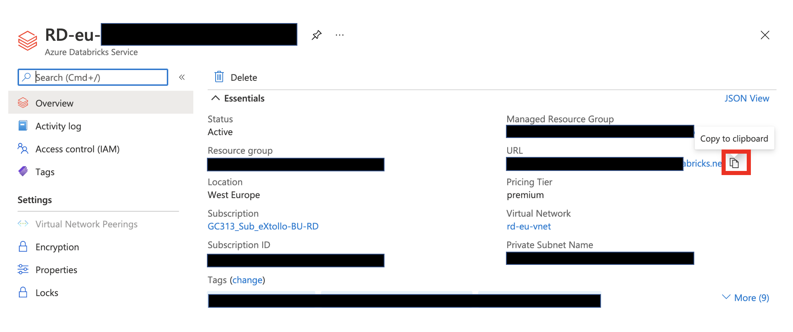
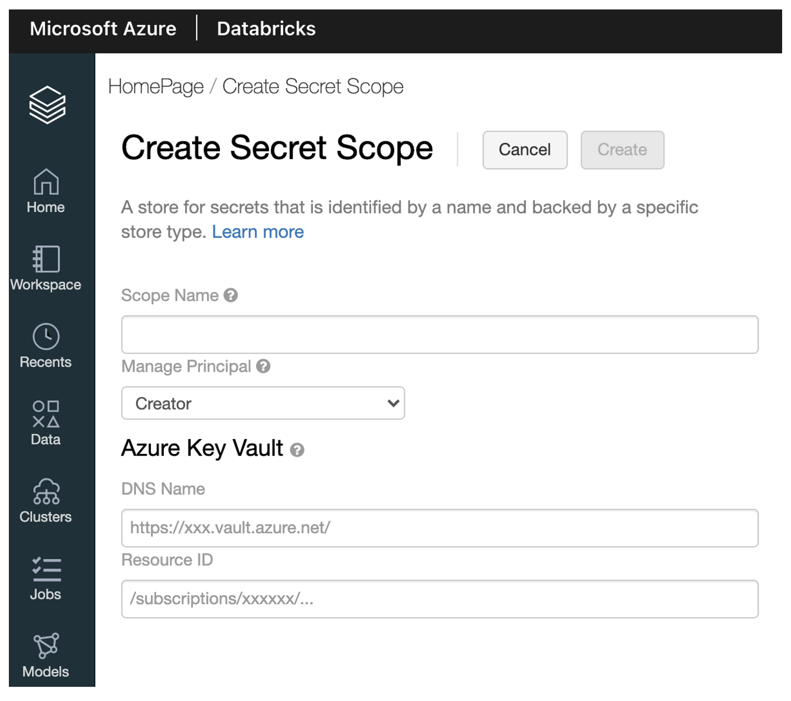
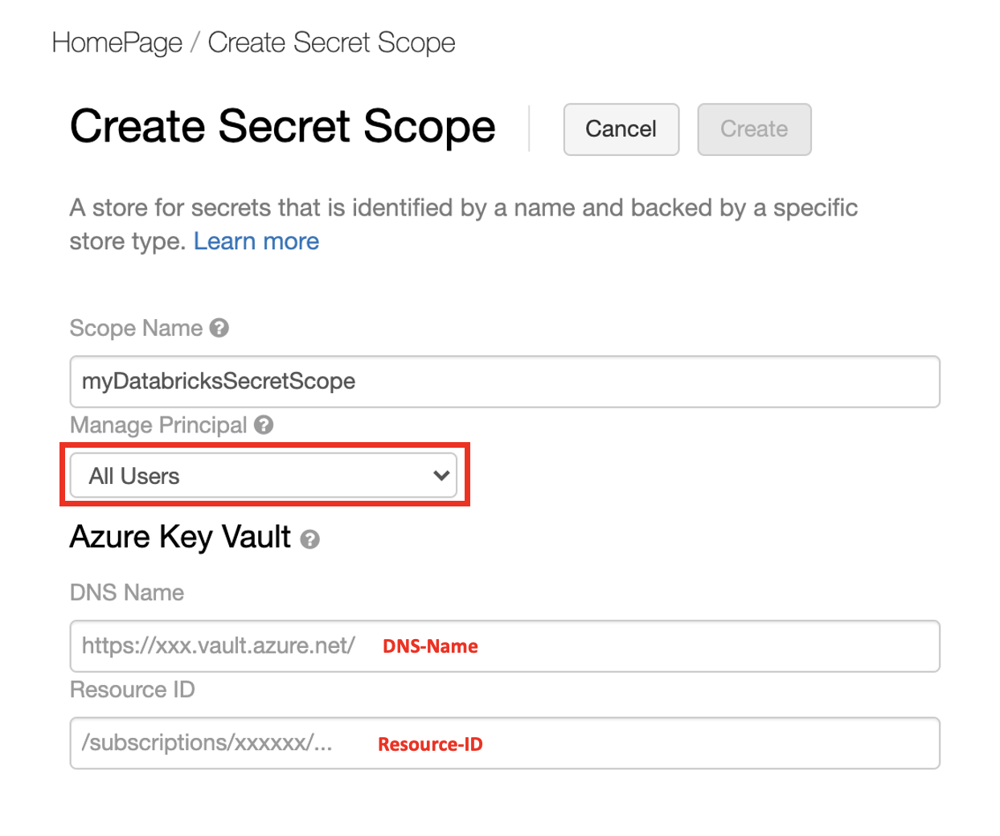

# Create Secret Scope in Databricks Workspace

Update!!: This step can currently just be done with eXtollo Support. 

1. Login to Azure Portal
2. Get Databricks Instance URL an copy it.
   
   
3. Enter the follwing url in your browser by replacing with your copied Databricks instance URL : **databricks-URL**#secrets/createScope
   
   

4. Get your DNS and Resource ID from Azure Key Vault

   

5. Create the scope with a name you like and enter the information copied from step 4 **Vault URL into DNS-Name** and **Resource ID to Resource ID** and make sure that **All Users** is activated under the **Managed Principal** Dropdown

   

6. Now your Azure Key Vault is linked to your Databricks Secret scope and you can get your credentials with the Azure KeyVault secret names in your notebooks. 


```python
secret = dbutils.secrets.get(scope="<Your Databricks Secret Scope>",key="<Name of secret in Azure Key Vault>")
```