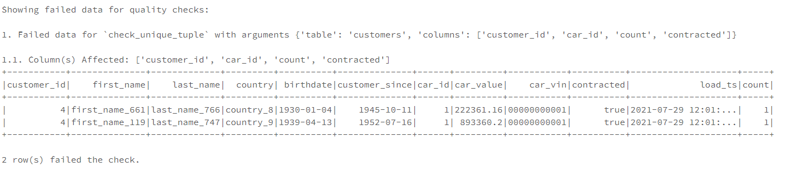
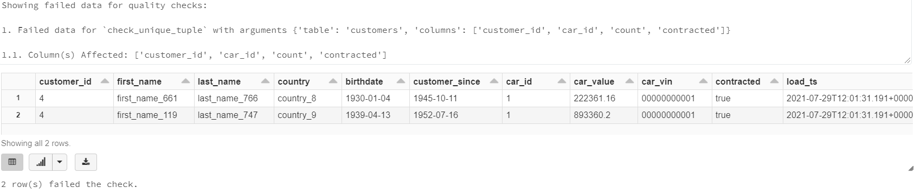
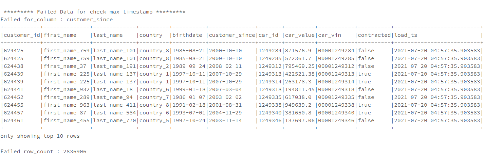
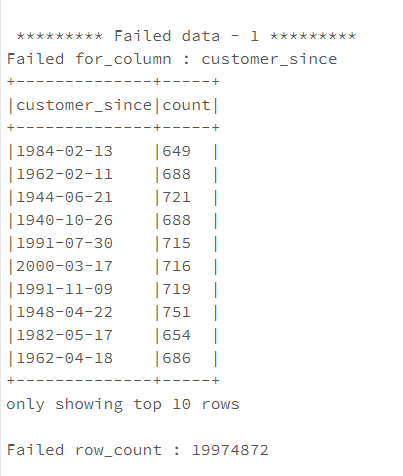

# Accessing Failed Data after running Checks

In the event of failing checks, DQF support a functionality where user can deep dive into the failed data for those 
checks.

This is achieved through the **failed_data** object.

**failed_data** object can be used to show the failed dataframe along with the failed column(s) name and the `row_count`
indicating the count of failed values/rows.

Failing data can be viewed in the following cases:
- *Running DQF with config*
    1.  Using show_failed_data() method
    2.  Using failed_data object
   
- *Running single check runs*


## Running DQF with config
### 1. Using show_failed_data() method
With the help of `show_failed_data()` method you can view all the failed data for each of failed check to the console.

```python
from dqf.main import CheckProject
check_project = CheckProject(config)
check_project.run()
check_project.show_failed_data()
```

Below is the result you get:
<p align="center"> 

</p>

Additionally, the `show_failed_data()` method, takes an optional argument, *disp_fun*, which is intended for only passing the `display` function available with Databricks notebook. It allows you to view the failed dataset table in a fairly nicer way.
<p align="center"> 

</p>

Note: since, *disp_fun* is a callable function, it can implemented in your project to display the dataframe in your desired way. Only thing to remember is that, it should only accept `dataframe` as it's required argument.


### 2. Using failed_data object
**failed_data** is part of `check_results` attribute of `CheckProject` class in DQF, in order to use **failed_data** 
run the DQF by passing a config and then loop through the check_results to print the failed data.

See below the code implementation

**Config file:**

````json
config = {
   "datasource_path": "/dbfs/mnt/cocbigdatard-prod/projects/DataQualityFramework/Testing/data/input//input/cars_Database_All_Formats/csv/customer_cars_dataset_ok/cars/",
   "data_format": "csv",
   "profile_name": "TestProfile_0",
   "load_options": {"inferSchema": "True", "header": "True"},
   "checks": [
      {
         "type": "check_max_timestamp",
         "kwargs": {
            "table": "customers",
            "columns": "customer_since",
            "timestamp": "2000-01-01"
         }
      }
   ]
}

````
**Code Implementation**

```python
# Run DQF by passing the config file
from dqf.main import CheckProject
check_project = CheckProject(config)
check_project.run()
```
```python
# Storing check_results in a variable "result"
result = check_project.check_results
```
```python
# Accessing failed_data for all the failing checks
for l in range(0,len(result)):
  failed_data_lst = result[l]["failed_data"]
  check = result[l]["type"]
  for i in range(0,len(failed_data_lst)):
    print("\n",f"********* Failed Data for {check} *********")
    for key, value in failed_data_lst[i].items():
        if key == "dataframe":
            value.show(20,False)
        else:
            print(f'Failed {key} : {value}')
```

This code will give the failed dataframe, failed column(s) name and count of failed values/rows for each failing check
<p align="center"> 

</p>


## Running single check runs

**failed_data** is an attribute of base class of each check, in order to use **failed_data**, 
run the single checks and then use **failed_data** to print the failed data.


**Code Implementation**

```python
# Import a single check "CheckUnique" run the check by passing appropriate arguments
from dqf.shared.checks import CheckUnique
check_project = CheckUnique(table="/opt/spark-data/customers", columns=["customer_since","birthdate"])
check_project.run()
```

```python
# Use failed_data attribute to store the failed data list in a variable "failed_data_lst" 
failed_data_lst = check_project.failed_data
```
```python
# Accessing failed_data 
for i in range(0,len(failed_data_lst)):
    print("\n",f"********* Failed data - {i+1} *********")
    for key, value in failed_data_lst[i].items():
        if key == "dataframe":
            value.show(20,False)
        else:
            print(f'Failed {key} : {value}')
```

This code will give the failed dataframe, failed column(s) name and count of failed values/rows for each failing column in that check
<p align="center"> 

</p>
