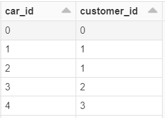
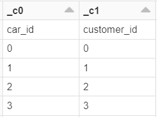
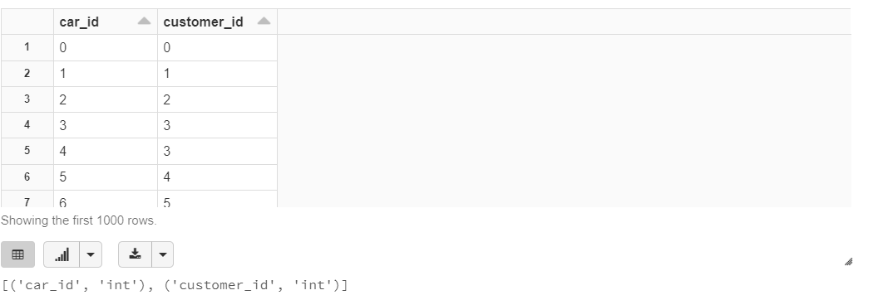

# Data Source Load options for DQF

DQF supports data to be loaded in any format whether its ORC,Parquet or CSV

There are load options available such as "inferSchema" and "Header" which can be set as True/False 

This load functionality is always **True** for ORC and Parquet file formats hence user does not need to give load options explicitly for these file formats

We need to configure these load options for CSV file format as these load options are **False** by default 


**Load Options**

> ***header***
> - if the csv file have a header (column names in the first row) then `"header"=True` will use the first row in the csv file as the dataframe's column names.
>
><p align="center"> 
>
> </p>
>
>- Setting `"header"=False` (default option) will result in a dataframe with default column names: _c0, _c1, _c2, etc
><p align="center"> 
>
> </p>


> ***inferSchema***
> - The schema referred here are the column types. A column can be of type String, Double, Long, etc. Using `"inferSchema"=False` (default option) will give a dataframe where all columns are strings (StringType)
> - By setting `"inferSchema"= True`, it will go through the csv file values and infer the schema of each column


## Configuring load options in DQF for CSV file format

In the config file include the key `load_options` and as values include the dictionary item `inferSchema` and `header` with their value set as True 

**Load option in Config file:**

````json
config = {
   "datasource_path": "/dbfs/mnt/cocbigdatard-prod/projects/DataQualityFramework/Testing/data/input//input/cars_Database_All_Formats/csv/customer_cars_dataset_ok/cars/",
   "data_format": "csv",
   "profile_name": "TestProfile_0",
   "load_options": {"inferSchema": "True", "header": "True"},
   "checks": [
      {
         "type": "check_max_timestamp",
         "kwargs": {
            "table": "customers",
            "columns": "customer_since",
            "timestamp": "2000-01-01"
         }
      }
   ]
}

````
**Code Implementation**

```python
from dqf.main import CheckProject
check_project = CheckProject(config)
check_project.run()
```
This will result in loading the csv file with headers and correct datatype for the columns
<p align="center"> 

</p>


